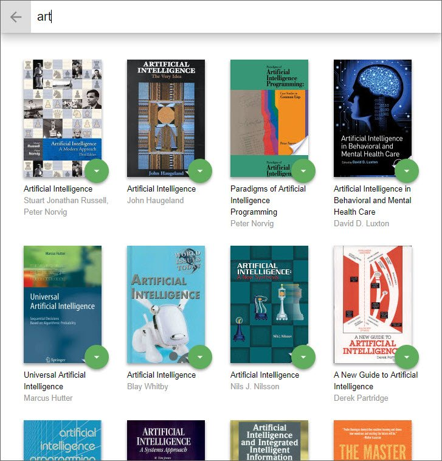

# MyReads

MyReads is a simple cataloging app that allows you to place books in one of three shelves or categories.

- Currently Reading
- Want to Read
- Read

It also allow you to search for books based on title and author.

This app is the first of three projects required for [Udacity's React Nanodegree program](https://www.udacity.com/course/react-nanodegree--nd019).

- **Live Demo:** [https://codesandbox.io/s/reactnd-project-myreads-6et42?file=/src/App.js](https://codesandbox.io/s/reactnd-project-myreads-6et42?file=/src/App.js)

You can see [screenshots](#screenshots) below.

## Installation

Clone the repository, change directories, and use NPM to install the dependencies.

```bash
$ git clone https://github.com/james-priest/reactnd-project-myreads.git
$ cd reactnd-project-myreads
$ npm install
```

## Usage

The project can be run with

- `npm start`

The project can be viewed in the browser at

- [http://localhost:3000](http://localhost:3000)

## Screenshots



